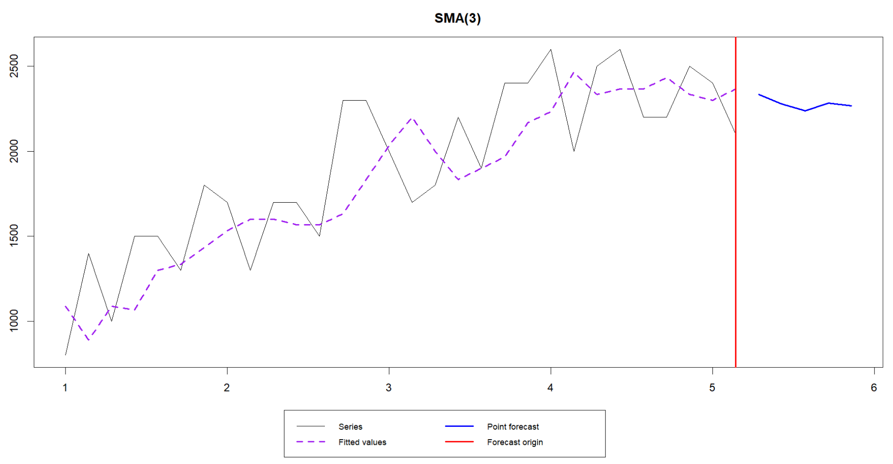

<br>

```{r setup, include=TRUE}
knitr::opts_chunk$set(echo = TRUE)

# Librerías
library(readxl)
library(forecast)
library(smooth)
library(dplyr)

```

<br>

Leer los datos
```{r}

datos <- read_excel("./demandas_semanales.xlsx")
attach(datos)

```

<br>

Convertir a objeto tipo serie de tiempo
```{r}
datos_ts = ts(datos$Demanda, start = c(1,1), frequency = 7)
datos_ts

```

<br>

## Utiliza  promedios  simples  basados  en  3  y  9  semanas  para  predecir  la  semana  de  las  cinco semanas siguientes.  

<br>

**PROMEDIOS SIMPLES BASADOS EN 3 SEMANAS (ma(order=3))**
```{r}
pronosMA3 <- ma(datos_ts, order=3)
summary(pronosMA3)
plot(datos_ts)
#lines(pronosMA3, col="red")

modeloMA3 <- arima(datos_ts,order=c(0,0,3))
summary(modeloMA3)

datos_ts.add <- decompose(datos_ts,type="additive")
datos_ts.mult <- decompose(datos_ts,type="multiplicative")

auto.arima(datos_ts,trace=T) #sacar mejor modelo
#ARIMA(2,1,0)(1,0,0)[7] --> mejor modelo según R

modeloMA3_2 <- arima(datos_ts, order=c(2,1,0),seasonal=list(order=c(1,0,0)))
modeloMA3_2


# -------- PRONÓSTICOS ---------

#datos_forecast_MA3 <- forecast(modeloMA3_2, h=5) #aquí debes poner el mejor modelo
#datos_forecast_MA3
#plot(datos_forecast_MA3)


datos_fc_MA3 <- sma(datos_ts,order=3,h=5,silent=FALSE)
fc1 <- forecast(datos_fc_MA3)
print(fc1)
```

<br>

**PROMEDIOS SIMPLES BASADOS EN 9 SEMANAS (ma(order=9))**
```{r}
pronosMA9 <- ma(datos_ts, order=9)
summary(pronosMA9)
plot(datos_ts)
#lines(pronosMA9, col="red")

modeloMA9 <- arima(datos_ts,order=c(0,0,9))
summary(modeloMA9)

datos_ts.add <- decompose(datos_ts,type="additive")
datos_ts.mult <- decompose(datos_ts,type="multiplicative")

auto.arima(datos_ts,trace=T) #sacar mejor modelo
#ARIMA(2,1,0)(1,0,0)[7] --> mejor modelo según R

modeloMA9_2 <- arima(datos_ts, order=c(2,1,0),seasonal=list(order=c(1,0,0)))
modeloMA9_2


# -------- PRONÓSTICOS ---------

#datos_forecast_MA9 <- forecast(modeloMA9_2, h=5) #aquí debes poner el mejor modelo
#datos_forecast_MA9
#plot(datos_forecast_MA9)


datos_fc_MA9 <- sma(datos_ts,order=9,h=5,silent=FALSE)
fc2 <- forecast(datos_fc_MA9)
print(fc2)
```

<br>

## Explica el comportamiento de los resultados obtenidos.  


Inicialmente se hace un suavizamiento de los datos para poder pasar a la predicción solicitada
Donde order equivale a las semanas tomadas en cuenta para hacer la predicción (en este caso 3 o 9) y h equivale a los periodos que se van a predecir (que serían 5).
 
Posteriormente, pasamos a la parte de predicción de los datos y, debido a los valores de suavizamiento usados, se puede apreciar que la gráfica de orden 3 describe mucho mejor a los datos y en la de orden 9 se generaliza el comportamiento de estos.


<br>

## ¿Cuál de los pronósticos obtenidos consideras más adecuado? ¿Por qué? 


Por las razones previamente explicadas, creemos que el pronóstico más adecuado es el 3 debido a que los valores obtenidos se ajustan mejor a los datos reales.



<br>
<br>
<br>